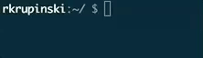

# isitfriday


Have you ever wondered if it's Friday? Wonder no more!




## Installation

```
$ yarn add isitfriday
```

## Usage

Programmatic:
```ts
import isitfriday from 'isitfriday';

isitfriday();                      // boolean
isitfriday(new Date('2023-02-17')) // boolean
isitfriday('2023-02-17');          // boolean
isitfriday(1676592000000);         // boolean
isitfriday('xD');                  // Error
```

Via `npx`:
```
$ npx isitfriday
```

CLI (global):
```
$ yarn global add isitfriday
$ isitfriday
```

CLI (local):
```
$ ./node_modules/.bin/isitfriday
```
